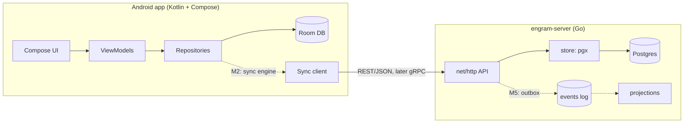

# engram

[](https://github.com/alvarogalhardo/engram/actions/workflows/server-ci.yml)
[](https://github.com/alvarogalhardo/engram/actions/workflows/android-ci.yml)
[](LICENSE)

> An *engram* is the physical trace a memory leaves in the brain.

**engram** is a spaced-repetition flashcards system built as a deliberate learning
project: an offline-first **Android client (Kotlin + Jetpack Compose)** backed by a
**sync server written in Go**, evolved milestone by milestone by applying the concepts
of [*Designing Data-Intensive Applications*](https://dataintensive.net/) (Kleppmann)
to a real product.

This is a **learning-in-public** repository. The scaffolding, specs, and failing tests
were set up with AI assistance; the feature implementations are written by me, issue by
issue, with the AI acting as mentor and reviewer — see [docs/mentoring.md](docs/mentoring.md)
and [CLAUDE.md](CLAUDE.md) for the rules of that contract.

## What works today

- ✅ Android app: SM-2 spaced repetition (Anki-style), `.apkg` deck import with media,
  Markdown/HTML cards, study stats — fully offline (39 unit tests on the pure domain)
- ✅ Go server skeleton: config, Postgres wiring, migrations, `/healthz`, CI with
  lint + race detector
- 🚧 Everything else is an [open milestone](https://github.com/alvarogalhardo/engram/milestones) —
  that's the point.

## Architecture



The sync model is intentionally simple at first (last-write-wins + tombstones, a
server-assigned sequence as the pull cursor) and gets more honest about distributed
systems as the milestones progress. The full protocol lives in
[docs/sync-protocol.md](docs/sync-protocol.md).

## Roadmap — DDIA chapters → milestones

| Milestone | Theme | DDIA chapters |
|---|---|---|
| M1 | Hello, server: data modeling, CRUD, hand-written SQL | 1–3 |
| M2 | Sync v1: offline-first, LWW, tombstones, logical cursors | 5 (+3) |
| M3 | Accounts & devices: transactions, hashing, multi-tenancy | 7 |
| M4 | Encoding & evolution: schema versioning, protobuf/gRPC spike, sqlc | 4 |
| M5 | The log: transactional outbox, consumers, rebuildable projections | 11 |
| M6 | Batch: nightly workers, retention curves, leech detection | 10 |
| M7 | Ship it: AWS (EC2 → Terraform + ECS Fargate + RDS + OIDC) | — |
| M8 | Android quality: i18n, `.apkg` export, FSRS, screenshot tests | — |

Long-form details in [docs/roadmap.md](docs/roadmap.md).

## Running locally

**Server** (needs Go 1.25+; Postgres optional — `/healthz` degrades gracefully):

```bash
cd server
make run          # or: go run ./cmd/engram-server
curl localhost:8080/healthz
```

**Full stack** (needs Docker):

```bash
cp .env.example .env   # adjust if you like
docker compose up --build
```

**Android**: open `android/` in Android Studio, or:

```bash
cd android && ./gradlew test assembleDebug
```

## Repository layout

```
android/   Kotlin + Compose app (own Gradle project)
server/    Go sync server (stdlib net/http, pgx, embedded migrations)
docs/      ADRs, sync protocol spec, roadmap, mentoring contract, AWS cost notes
infra/     docker-compose + Terraform skeleton (used from M7 on)
```

## License

[MIT](LICENSE)
